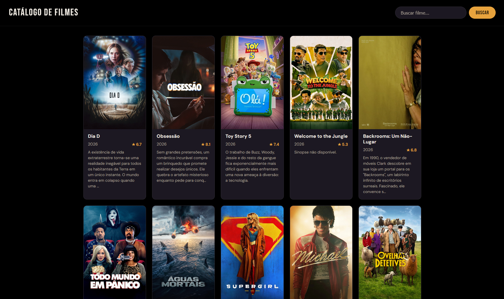
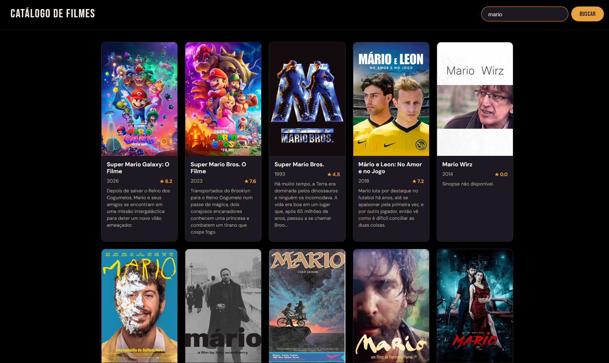

# Trabalho Prático - Semana 12

Fetch API + The Movie DB (TMDB). Catálogo de filmes que consome dados reais da API do TMDB, exibe os resultados em cards e permite busca por nome.

## Informações Gerais

- Nome: Lucas Oliveira Dias
- Matrícula: 907253

## Estrutura do projeto

- `public/index.html` — página do catálogo
- `public/assets/css/styles.css` — estilos (tema escuro)
- `public/assets/scripts/app.js` — lógica de requisição e renderização

## Endpoint utilizado

- Lista inicial: `GET /movie/popular` (filmes populares)
- Busca: `GET /search/movie?query=...` (pesquisa por nome)

## Fluxo (requisição → tratamento → renderização)

A função `fetchMovies()` monta a URL (populares quando não há busca, `/search/movie` quando há texto) e faz a requisição com a Fetch API usando `async/await`. A resposta é convertida com `.json()` e o array `results` é repassado para `renderMovies()`, que limpa o container e gera um card por filme via `createMovieCard()` (createElement / classList / appendChild). Estados de carregando, vazio e erro são exibidos por `showMessage()`.

## Prints

Lista de filmes carregada (populares):

Resultado após a busca:

